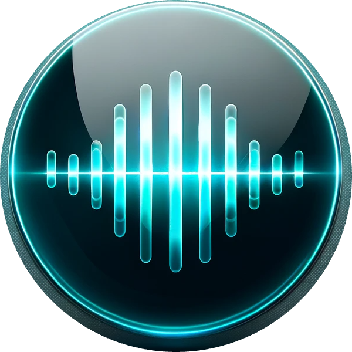

<div align="center">
  
  <h1>Echo</h1>
  <p>Your AI-powered voice companion for macOS</p>

  <p>
    <a href="#installation">Install</a> •
    <a href="#features">Features</a> •
    <a href="#usage">Usage</a> •
    <a href="#troubleshooting">Help</a>
  </p>
</div>


## 🚀 Quick Start

```bash
# Clone the repository
git clone https://github.com/philip-zelichenko/echo/echo.git
cd echo

# Run the installer
python3 install.py
```

That's it! Follow the prompts and enter your OpenAI API key when asked.

## ✨ Features

- 🎙️ **Voice Recording**: Instantly capture your thoughts with F9
- 🔄 **Smart Tones**: Switch between friendly and professional responses (F6)
- 💬 **Chat Modes**: Adapt to different conversation styles (F7)
- 📊 **Live Status**: Quick status overview (F8)
- 🔥 **Menu Bar Integration**: Always ready, never in your way
- ⚡ **Instant Responses**: Powered by ChatGPT

## 📋 Requirements

- macOS
- OpenAI API key ([Get yours here](https://platform.openai.com/api-keys))

## 🎯 Usage

Echo lives in your menu bar - look for this icon: 

| Shortcut | Action |
|----------|--------|
| F9 | Start/Stop Recording |
| F6 | Toggle Tone |
| F7 | Switch Chat Mode |
| F8 | Show Status |

## 🔧 Troubleshooting

<details>
<summary>Keyboard shortcuts not working?</summary>

1. Open System Settings
2. Navigate to Privacy & Security → Accessibility
3. Enable Echo
</details>

<details>
<summary>Microphone not working?</summary>

1. Open System Settings
2. Navigate to Privacy & Security → Microphone
3. Enable Echo
</details>

## 🗑️ Uninstall

```bash
/Applications/Echo.app/Contents/Resources/scripts/uninstall.sh
```

## 💡 Support

Having issues or questions? [Open a GitHub issue](https://github.com/yourusername/echo/issues/new)!

---

<div align="center">
  <p>Made with ❤️ for productivity</p>
</div>
